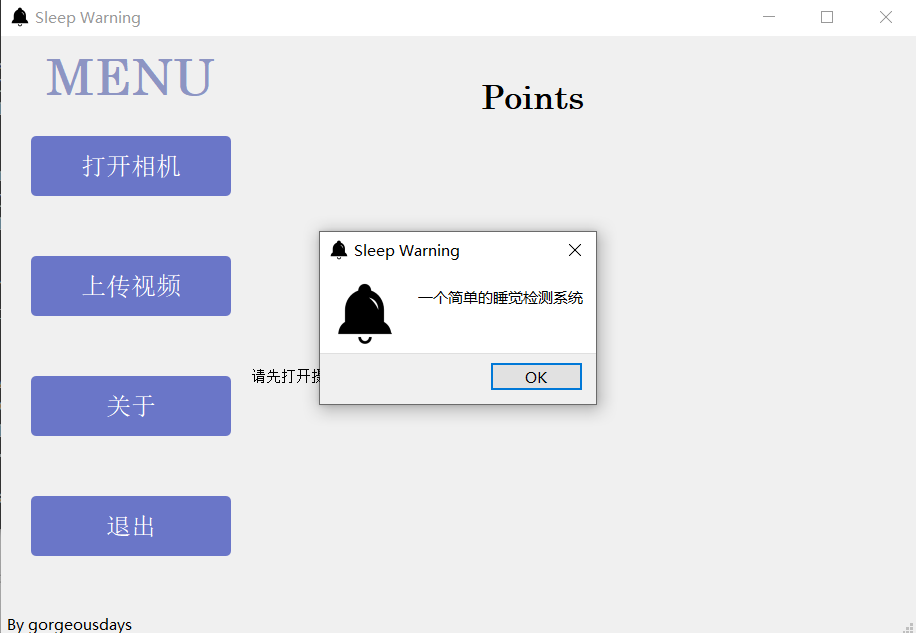

# Sleep-Warning

## introduction

 A simple sleep detection system.



## DataSet

http://mrl.cs.vsb.cz/eyedataset

## Installation

1. Clone this repository:

   ```
   https://github.com/gorgeousdays/Sleep-Warning.git
   ```

2. Install dependencies from within Sleep-Warning directory

   ```
   pip install -r requirements.txt
   ```

3. Start the project

   ```
   python main.py
   ```

   

